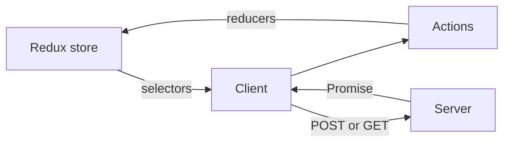
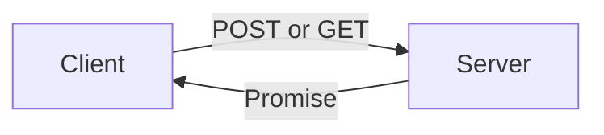
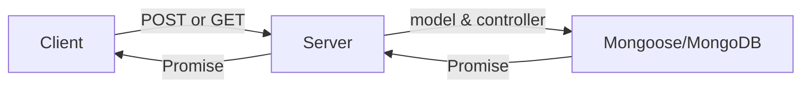

# M4OPS2 Notes Standards and Practices

- [M4OPS2 Notes Standards and Practices](#m4ops2-notes-standards-and-practices)
  - [Overview](#overview)
    - [Notes on this document](#notes-on-this-document)
  - [Some useful Terminology (of various sorts)](#some-useful-terminology--of-various-sorts-)
  - [The stack](#the-stack)
  - [Creating a project](#creating-a-project)
  - [Folder and File set-up](#folder-and-file-set-up)
  - [Visual Studio Code](#visual-studio-code)
    - [Sandbox](#sandbox)
    - [GIT – for source code version control](#git-for-source-code-version-control)
    - [Eslint for proofing code](#eslint-for-proofing-code)
    - [Documenting](#documenting)
  - [HTML5 standards](#html5-standards)
  - [JS and ES6 standards](#js-and-es6-standards)
    - [Special functions & routines](#special-functions---routines)
  - [Client Overview](#client-overview)
    - [The Starting point](#the-starting-point)
  - [React and JSX](#react-and-jsx)
    - [Useful components](#useful-components)
  - [CSS and styling](#css-and-styling)
  - [Data - in Redux](#data---in-redux)
    - [Using data in the store](#using-data-in-the-store)
    - [Changing data in the store](#changing-data-in-the-store)
    - [Ducks](#ducks)
    - [References](#references)
  - [Debugging](#debugging)
  - [OpenLayers](#openlayers)
  - [Server Overview](#server-overview)
    - [Connecting to MongoDB](#connecting-to-mongodb)
    - [Notes](#notes)
  - [MongoDB](#mongodb)
  - [Webpack and Babel](#webpack-and-babel)
  - [Testing](#testing)
  - [Other Notes](#other-notes)

[Table of contents generated with markdown-toc](http://ecotrust-canada.github.io/markdown-toc/)

## Overview

This is an eclectic, pragmatic working document to help me remember how to do things, and evolving as I get more experience. It has lots of links for useful reference. Be aware that although the intention is there, it is likely that at any time the code will not meet the standards by a long way. There is also lots of stuff here that I do not understand yet!

Although fairly complex, this is a simplified approach to aid understanding, development and maintenance, and has been adapted in the light of experience. See other possibilities in [M4OPS2 Other Technical Possibilities](M4OPS2OtherTechnicalPossibilities.md), although as we go on any that are actually used will be moved from there into this document.

### Notes on this document

- To see diagrams you need [mermaid](https://mermaidjs.github.io/) installed
- Do not use , ( ) / in headings else links from TOC will not function without manual change

## Some useful Terminology (of various sorts)

- Semantic versioning (**semver**) - Change major number when it may break existing usages

- a software **stack** is a set of software subsystems or components needed to create a complete platform such that no additional software is needed to support applications

- **polyfill** - a snippet of code that patches a piece of functionality that's missing in some browsers.
  - **ponyfill** provides that functionality as a standalone module you can use – see [this discussion](https://ponyfoo.com/articles/polyfills-or-ponyfills)

- Function **currying** is the process of successive partial applications, until the last argument is given at which point the result of the function is returned

- [**functional programming**](https://en.wikipedia.org/wiki/Functional_programming) is a style of building computer programs—that treats computation as the evaluation of mathematical functions and avoids changing-state and mutable data. In contrast, imperative programming changes state with commands in the source code, the simplest example being assignment. (Ignore as too complex?)

- A [**closure**](https://stackoverflow.com/questions/111102/how-do-javascript-closures-work) is the combination of a function and the scope object in which it was created. Closures let you save state — as such, they can often be used in place of objects. (Not used here)

- **CRUD** - create, read, update, and delete

- **REST** stands for Representational State Transfer -The fundamental concept within REST is that of a resource - the object we are operating on. For each resource we define what methods can operate on that resource. Methods such as GET, POST, UPDATE, DELETE.

- **HOC** - [higher-order component](https://reactjs.org/docs/higher-order-components.html) in React - a function that takes a component and returns a new component.

- a **variadic function** is one of indefinite arity, i.e., one which accepts a variable number of arguments

- Parentheses, Braces, or Brackets?
  - Round: Parentheses () for function calls, conditional statements, or enforcing Order of Operations.
  - Curly: Braces {} for the declaration of Object Literals, or to enclose blocks of code
  - Square: Brackets \[\]for accessing the properties of an Object (or the elements of an Array)

- **ORM** - Object-relational mapping for converting data between object-oriented and relational forms

- [Duck Typing](http://adripofjavascript.com/blog/drips/using-duck-typing-to-avoid-conditionals-in-javascript.html) is better than using instanceof

- **memoization** (memoisation) is an optimization technique used primarily to speed up computer programs by storing the results of expensive function calls and returning the cached result when the same inputs occur again.

- a [**Promise**](https://codeburst.io/a-simple-guide-to-es6-promises-d71bacd2e13a) is an object that is used as a placeholder for the eventual results of a deferred (and possibly asynchronous) computation.

## The stack

The main stack is

- the client: OpenLayers, Vue.js (and Vuex), Webpack
- \<-via REST API-\>
- the server: Express, Node, MongoDB

## Creating a project

Note that the –save option for npm install is now the default, so is not needed. For details of each package search below.

- consider
  - [lodash](https://lodash.com/) - every useful function you ever need(!)

## Folder and File set-up

See [structuring-a-react-project](https://blog.bitsrc.io/structuring-a-react-project-a-definitive-guide-ac9a754df5eb)

Folder names are in lower case.  Filenames are in camelCase according to the job that they perform, eg userDropdown.js. Except that components are in PascalCase.

- client
  - public – for index.html, and resources
  - src
    - \[files\] - App.jsx, Home.jsx, index.js, registerServiceWorker.js
    - global - a few components, utilities, styles, constants etc that can be used anywhere
    - images - a few images used in the app (not data for an OPS)
    - store - for the Redux store, reducer registry and related middleware
    - styles - (currently) a single xx.css file as per [React FAQ](https://reactjs.org/docs/faq-styling.html)
      - Note that css files are often in the same folder as the component they are relevant to
    - subsystems - for routines by application area (will change)
      - \[files\] - stateChangeActions.js file specifying functions for the onStateChange functions in configureStore.js
      - demo - to do
      - framework - overall, header, sidebar
      - geography - continents, places (OPS)
      - loading - common functionality to handle loading flags
      - mapping
      - params - parameters to the URL
- server
  - \[files\] - app.js, .env
  - controllers
  - middleware
  - models
  - routes
- .vscode - for launch.json, settings.json etc that guide how VSCode and its extensions work

Notes: Each folder

- can have a README.md file describing it
- can have .gitignore for files to be excluded from git
- can have a node_modules subfolder - this is where npm puts all its packages
- can have a package.json/package-lock.json specifying dependencies etc. for npm
- can have .eslintignore for files to be excluded from eslint
- can have .eslintrc.json to direct eslint and give it parameters

Each client subsystem folder (possibly subdivided into subfolders) has

- an index.js file for the duck (see Redux/data)
- container components (named XxxContainer)
- presentation components
- supporting utilities and functions

## Visual Studio Code

- Our main development environment is VSCode - intelligent code editing
- [Documentation](https://code.visualstudio.com/docs?start=true) and [Chrome debugging in VSCode](https://github.com/Microsoft/vscode-chrome-debug/blob/master/README.md#troubleshooting)

- Use Ctrl+Shift+P for the list of commands (Ctrl+S to save - but we have set it to save automatically), and use Ctrl+space for **context-sensitive snippets** (or start typing)

- For documentation and markdown see separate [Documenting](#Documenting) section below
  
- Useful about [Node.js and Express](https://code.visualstudio.com/docs/nodejs/nodejs-tutorial) and about [React, Markdown and Linting](https://code.visualstudio.com/docs/nodejs/reactjs-tutorial) in VSCode

- Using [Code Spell Checker](https://marketplace.visualstudio.com/items?itemName=streetsidesoftware.code-spell-checker)
  - can Enable / Disable checking sections of code with // cSpell:disable

- Includes [Emmet](https://docs.emmet.io/) - snippets etc

- Use [es7-react-js-snippets](https://marketplace.visualstudio.com/items?itemName=dsznajder.es7-react-js-snippets) especially:

| enter | snippet |
| ---- | ---- |
| **enf** | **export const functionName = (params) =\> { }** |
| edf | export default (params) =\> { } |
| fre | arrayName.forEach(element =\> { } |
| **nfn** | **const functionName = (params) =\> { }** |
| **cmmb** | **js comment block** |
| imrpcp | import React, { PureComponent } from 'react' & import PropTypes from 'prop-types' |
| imrd | import ReactDOM from 'react-dom' |
| redux | import { connect } from 'react-redux' |
| **cdm** | **componentDidMount = () =\> { }** |
| ren | render() { return( ) } |
| ssf | this.setState((state, props) =\> return { }) |
| props | this.props.propName |
| state | this.state.stateName |
| bnd | this.methodName = this.methodName.bind(this) |
| pt… | PropTypes….(eg ptaor=.arrayOf(name).isRequired) |
| clg | console.log(object) |
| **rpcp** | **a React PureComponent with PropTypes** |
| **rcredux** | **a container (Redux) module** |
| reduxmap | const mapStateToProps = state =\> ({}) / const mapDispatchToProps = {} |
| desc | (in tests) describe … |
| test | test('should etc… |
| tit | (in tests) it('should $1', etc |
| hoc | a hoc - higher-order component |
| hocredux | hoc for redux |

### Sandbox

We have a [codeSandox](https://codesandbox.io/u/PeterC66) for trying things out

### GIT for source code version control

- [GitHub](https://github.com/) P6 XXXX is the git server where my projects are

- [Projects on GitHub](https://github.com/explore); [GitHub Marketplace](https://github.com/marketplace); [Help](https://help.github.com/); free to use for public and open source projects

- With [gists](https://help.github.com/articles/about-gists/), you can share single files, parts of files, and full applications - powered by [CodeMirror](https://codemirror.net/).

- On forking see [How to fork a dependency and use it locally in a project](https://medium.com/@chrisdmasters/how-to-fork-a-dependency-and-use-it-locally-in-a-project-707c80d3449c), [npm link](https://docs.npmjs.com/cli/link) and [Package linking](https://medium.com/@alexishevia/the-magic-behind-npm-link-d94dcb3a81af)
  
  - and even [creating your own project from a fork](https://stackoverflow.com/questions/18390249/github-make-fork-an-own-project)

  - we have the very helpful **Pro Git** book, written by Scott Chacon and Ben Straub - then follow up with [Git support in VSCode](https://code.visualstudio.com/docs/editor/versioncontrol#_git-support)

- [Excellent Tutorial/Reference on git and GutHub](https://kbroman.org/github_tutorial/) - [commands](https://github.com/kbroman/Tools4RR/blob/master/04_Git/GitCommands/git_notes.md), [cheat sheet](https://git-scm.com/docs/)
- GIT locally on [GIT for Windows](https://gitforwindows.org/)
  - as GitHub Desktop is not for use from outside
  - Chose option to checkout Windows-style
  
- [Issues](https://guides.github.com/features/issues/) are suggested improvements -each contains its own discussion forum, [Glossary](https://help.github.com/articles/github-glossary/)

- [Pull requests (PRs)](https://help.github.com/articles/about-pull-requests/) let you tell others about changes you've pushed to a branch (ie you are Requesting that they Pull from your repository)

- [To clone a repository from GitHub to local](https://help.github.com/articles/cloning-a-repository/) (don't create folder first)

- [GitHub Guides](https://guides.github.com/); [Learn Git and GitHub](https://medium.freecodecamp.org/how-you-can-learn-git-and-github-while-youre-learning-to-code-7a592ea287ba)
- [Useful guide to git protocol](https://medium.com/@francesco.agnoletto/how-to-not-f-up-your-local-files-with-git-part-1-e0756c88fd3c) and [Learn Version Control with Git](https://www.git-tower.com/learn/git/ebook/en/desktop-gui/basics/what-is-version-control#start)

- Notes
  - Initialise repository for this project, or "clone" (=download / copy) one to your local computer
  - A [helpful compilation of ignore rules](https://github.com/github/gitignore)
  - Files are "untracked" (not under version control, yet), or "tracked" - Git watches for changes
  - Commit Only Related Changes: Working copy \> Staged (ready for commit) \> Local Repository
  - Write Good Commit Messages
  - Use Branches Extensively - for new features, bug fixes, experiments, ideas: it is quick and easy
  - Never Commit Half-Done Work
  - Think of Stashes as a clipboard on steroids: it takes all the changes in your working copy and saves them for you, leaving a clean working copy. Later, you can restore the changes from that clipboard in your working copy current HEAD branch - and continue working where you left off.
  - You can merge (one branch into another - HEAD) as often as you like
  - One Long-Running Branch Only - your production code- all new topic branches are based off (and merged into) this "master" branch
  - A "[Submodule](https://www.git-tower.com/learn/git/ebook/en/desktop-gui/advanced-topics/submodules#start)" is just a standard repository (pointing to a specific commit) nested inside a parent repository. To include a code library, you can simply add it as a Submodule in your main project.
  - using [gitlens in VSCode](https://github.com/eamodio/vscode-gitlens/#gitlens-explorer) for examining the git history of files
- Our simple workflow is (using Ctrl-Shift-P each time)
  - Checkout to...
  - +Create new branch - give it a name (XXX)
  - do work until system is working OK
  - Checkout to Master branch
  - Merge branch XXX
  - Delete branch XXX
- Every now and then publish changes (to origin - which is peterC66/m4ops)

### Eslint for proofing code

- [Set up guide](https://travishorn.com/setting-up-eslint-on-vs-code-with-airbnb-javascript-style-guide-6eb78a535ba6) includes style –uses [eslint-config-airbnb-base](https://www.npmjs.com/package/eslint-config-airbnb-base) (-base for non-react), [guide to configuring](https://eslint.org/docs/user-guide/configuring)
  - npm i -D eslint eslint-config-airbnb-base eslint-plugin-import
  - Create .eslintrc.js: module.exports = { "extends": "airbnb-base" };

- Note that we don't use [setting up global eslint in VSCode](https://medium.com/@davidchristophersally/how-to-set-up-eslint-in-vscode-globally-253f25fbaff9) (because create-react requires it local)

- Note that any plugins or shareable configs that you use must also be installed locally to work with a locally-installed ESLint

- [List of rules](https://eslint.org/docs/rules/) and [Configuring in detail](https://eslint.org/docs/user-guide/configuring) (including [via in-file comments](https://eslint.org/docs/user-guide/configuring.html#disabling-rules-with-inline-comments))

- particular uses
  - // eslint-disable-line no-console after any wanted console statement
  - // eslint-disable-line react/forbid-prop-types after any line where you need to use PropTYpes array or object
  - in js containers where we need to render a (single?) line of jsx
    - /* eslint-disable react/jsx-filename-extension */ just before it
    - /* eslint-enable react/jsx-filename-extension */ just after it
  - /* eslint-disable react/prefer-stateless-function */ where we know component should not be written as a pure function
  - /* eslint-disable import/prefer-default-export */ where we know more exports are coming
  - // eslint-disable-line object-shorthand after where we cannot use shorthand
  - // eslint-disable-line no-alert after where we want an alert
  - // eslint-disable-line no-use-before-define after any function we know this aplies to (it is OK)

### Documenting

- (eg this) use [GitHub flavoured markdown](https://github.github.com/gfm/) (gfm)  - [Mastering GitHub flavoured markdown](https://guides.github.com/features/mastering-markdown/)
- [Markdown quick reference](https://www.markdownguide.org/cheat-sheet) (not GitHub), see also [Writing on GitHub](https://help.github.com/categories/writing-on-github/)

- see also [markdown cheat sheet](https://www.makeuseof.com/tag/printable-markdown-cheat-sheet/)

- lint using [markdownlint](https://marketplace.visualstudio.com/items?itemName=DavidAnson.vscode-markdownlint) - see also [configuration](https://github.com/DavidAnson/markdownlint#configuration)

- could use [markdown-style-guide](http://www.cirosantilli.com/markdown-style-guide/) but not easily linted in VSCode so stick with [markdownlint RULES](https://github.com/markdownlint/markdownlint/blob/master/docs/RULES.md)

- use [mermaid](https://mermaidjs.github.io/) in markdown for charts - Flowchart, Sequence diagram, Gantt diagram - but GitHub does not use mermaid

- use [pandoc](https://pandoc.org/index.html) to convert from Word to markdown– see [User Guide](https://pandoc.org/MANUAL.html), but as we have permissions problems so **as cmd Admin user**:
  - cd C:\\Users\\Peter Admin\\AppData\\Roaming\\pandoc, and do everything there
  - pandoc -f docx -t gfm “C:\\Users\\Peter\_2\\Documents\\Mapping\\Software\\M4OPS2\\Documentation\\filename.docx” -o filename.md
- for relative links use \[a relative link\](other\_file.md)

- react-geo uses [React Styleguidist](https://react-styleguidist.js.org/) - auto-generated

## HTML5 standards

- See [html5doctor's tag/element-index](http://html5doctor.com/element-index/) and [their flow chart](h5d-sectioning-flowchart.png) for use of \<section\> etc

## JS and ES6 standards

- [Airbnb JavaScript Style Guide](https://github.com/airbnb/javascript)
- useful book - [Exploring ES6](http://exploringjs.com/es6/) covers every level
- [useful list of es6 features](https://github.com/lukehoban/es6features)
- newline between dependency imports and local imports
- in Node.js continue to use  module.exports (or just exports.) and  require rather than export and import
- (NOT YET) could use object literals instead of switch statements as per [this suggestion](https://medium.com/chrisburgin/rewriting-javascript-replacing-the-switch-statement-cfff707cf045)
- Add comments only to explain complex thoughts
- Boolean variables, or functions that return a boolean value, should start with “is,” “has” or “should.
- use [has()](https://www.npmjs.com/package/has) instaed of hasOwnProperty as it is better
- (someone says we don't need to call `super(props)`, unless you need to use `this.props` inside the constructor)
- Use [Flow](http://flowtype.org/)
    ([Documentation](https://flow.org/en/docs/)) for static typing see eg [here](https://medium.freecodecamp.org/why-use-static-types-in-javascript-part-1-8382da1e0adb)
  - add // @flow to any files you want to type check (for example, to src/App.js (TO DO)
  - npm run flow to check the files for type errors
- for maps
  - [new ES6 standard maps](https://developer.mozilla.org/en-US/docs/Web/JavaScript/Reference/Global_Objects/Map), and
  - [what-you-should-know-about-es6-maps](https://hackernoon.com/what-you-should-know-about-es6-maps-dc66af6b9a1e)
  - excellent [article about maps](https://flaviocopes.com/javascript-data-structures-map/)
  - [array-vs-set-vs-map-vs-object](https://codeburst.io/array-vs-set-vs-map-vs-object-real-time-use-cases-in-javascript-es6-47ee3295329b)
  - Note that we often use [k, v] meaning key, value
  - The [collections.js](http://www.collectionsjs.com/) package provides JavaScript implementations of common collections, with many useful features but they rae less relevant now we have maps
- for arrow functions
  - [ES6 Arrow Functions: Fat and Concise Syntax in JavaScript](https://www.sitepoint.com/es6-arrow-functions-new-fat-concise-syntax-javascript/)
  - [Flowchart for arrow functions](https://github.com/getify/You-Dont-Know-JS/blob/master/es6%20%26%20beyond/fig1.png)
  - [When (and why) you should use ES6 arrow functions — and when you shouldn’t](https://medium.freecodecamp.org/when-and-why-you-should-use-es6-arrow-functions-and-when-you-shouldnt-3d851d7f0b26)
  - [Documentation](https://developer.mozilla.org/en-US/docs/Web/JavaScript/Reference/Functions/Arrow_functions)

### Special functions & routines

- For URLs etc use [url-parse](https://www.npmjs.com/package/url-parse), which includes [querystringify](https://gitlab.cs.washington.edu/glassctm/CShark/tree/55346ca6b16c6bbdadb94701dd554f26b17a3633/node_modules/querystringify) - which has just parse and stringify methods

- use [cuid](https://github.com/ericelliott/cuid) for IDs

- use [redux-orm](https://github.com/tommikaikkonen/redux-orm) - for using relational data in Redux

- lodash has many useful functions
  - just import _ from 'lodash' (see [benchmark](https://www.blazemeter.com/blog/the-correct-way-to-import-lodash-libraries-a-benchmark))- eventually use [babel-plugin-lodash](https://github.com/lodash/babel-plugin-lodash)
  - for iteratees see [lodash documentation](https://lodash.com/docs/4.17.10#iteratee), and [this explanation](https://stackoverflow.com/questions/43384596/can-you-please-explain-lodash-iteratee-function-in-english)

## Client Overview

### The Starting point

public/index.html is the file a browser will open - this provides a title and a root div, and runs client/src/index.js which takes the output of App.js and puts it into the root div.

The client is the system that the user interacts with.  The server is the system that the client system can use, eg if it wants to store or retrieve data). We keep these systems separate, and develop them separately.

When the client needs to communicate with the server it sends an asynchronous request (with a promise attached) and when the server is done it notifies the client the promise has been completed. The client can then do any more processing dependent on the promise being completed. [More on this later.]

(Almost) all of the state of the client is held in the Redux store, and access to it is very structured [see later].

## Bundler - Parcel

- We use [Parcel](https://parceljs.org/) as it is 'no configuration'.
- See also [A quick look at Parcel](https://glebbahmutov.com/blog/parcel/), and [Getting Started With Parcel](https://medium.com/codingthesmartway-com-blog/getting-started-with-parcel-197eb85a2c8c)
- OL has [this example](https://github.com/openlayers/ol-parcel), and their [Building an OpenLayers Application tutorial](http://openlayers.org/en/latest/doc/tutorials/bundle.html)

## Debugging

Use [VS Code debugging](https://code.visualstudio.com/docs/editor/debugging)
[make-console-log-output-colorful](http://voidcanvas.com/make-console-log-output-colorful-and-stylish-in-browser-node/)
See also

- [Lighting Up Your JavaScript With the Debugger](https://peterlyons.com/js-debug) - links to
  - [Node Inspector Docs](https://nodejs.org/en/docs/inspector/)
  - [Chrome Developer Tools Docs](https://developers.google.com/web/tools/chrome-devtools/)
  - [Lesser-Known JavaScript Debugging Techniques](http://amasad.me/2014/03/09/lesser-known-javascript-debugging-techniques/)
  - [Debugging Asynchronous JavaScript with Chrome DevTools](http://www.html5rocks.com/en/tutorials/developertools/async-call-stack/)
  - [Watch Me Code Debugging Screencasts](https://sub.watchmecode.net/series/debugging-javascript/)

- Note that a DOM node with a property = a Function is reported as "[object Function]"
  - a property = an Object is reported as "[object Object]" (similarly for an Array etc)

## OpenLayers

Use version number eg v4.6.5 (which is the one we use) or latest

- [Documentation](http://openlayers.org/en/v4.6.5/doc/)
- [Tutorials](http://openlayers.org/en/v4.6.5/doc/tutorials/)
- [(Current) Workshop](http://openlayers.org/workshop/en/))
- [API](http://openlayers.org/en/v4.6.5/apidoc/)
- [Examples](http://openlayers.org/en/v4.6.5/examples/)
- [(Latest) code](https://github.com/openlayers/openlayers)
- [ol on npm](https://www.npmjs.com/package/ol)
- [Releases on GitHub](https://github.com/openlayers/openlayers/releases/)

To link from React to [OpenLayers](http://openlayers.org/en/v5.1.3/doc/) we are using the [react-geo package](https://terrestris.github.io/react-geo/docs/latest/index.html#introduction) - includes details of components

- a set of geo related modules to use in combination with React, Ant Design UI and OpenLayers from terrestris
- see the useful [basic workshop](https://terrestris.github.io/react-geo-ws/) and [examples](https://terrestris.github.io/react-geo/examples/index.html) - (less up to date than the documentation?)
- the [GitHub project](https://github.com/terrestris/react-geo) has other links
- for more design options see [Ant Design](https://ant.design/components/button/)
  - for icons see  [Ant Design icons](https://ant.design/components/icon/#List-of-icons), or [Fontawesome Free](https://fontawesome.com/icons?d=gallery&m=free)
  - for more on how to change theme/colours etc see [Using Ant Design in create-react-app](https://ant.design/docs/react/use-with-create-react-app)
- for geospatial analysis react-geo uses [Turfjs](http://turfjs.org/)
- for testing we copied
  - babelrc

## Server Overview

When the client needs to communicate with the server it sends an asynchronous GET or POST request via eg fetch(`/continents`). The corresponding route is defined in the server's routes folder (and referenced in its app.js). When the server is done it notifies the client, which can then do any more processing dependent on the promise being completed.

The main program is app.js which sets up connections to the database, (express) routes, and listens on a port.

Each route (including with parameters eg :id) is

- in a file in the server/routes folder, which is
- referred to in app.js
- can be called from the client by eg fetch(`/continents`)

### Connecting to MongoDB

The MongoDB URL (including database) is set in .env.

For each type of data held in the database, (via [Mongoose](https://mongoosejs.com/docs/guides.html)) we have

- a data structures (or [schema](https://mongoosejs.com/docs/guide.html)) defined in a file in the server/models folder
- a [model](https://mongoosejs.com/docs/models.html) defined in the same file
- a controller in the server/controllers folder that [queries, deletes and/or updates](https://mongoosejs.com/docs/queries.html) the data using [MongoDB](https://docs.mongodb.com/manual/tutorial/query-documents/)
- call(s) from routes to the controller to do its work

### Notes

- the file .env is for environment variables handled by dotenv
- middleware
- client/src/registerServiceWorker.js is used just in production

## MongoDB

- provides users with a NoSQL document database system (Open Source) [Documentation](https://docs.mongodb.com/manual/introduction/)

- [Install MongoDB Community Edition on Windows](https://docs.mongodb.com/manual/tutorial/install-mongodb-on-windows/)
  - Start windows service: Command line as Administrator “net start MongoDB” (not Powershell)

- MongoDB is designed to be run in trusted environments (ie Localhost)

- URL (if we needed it) is mongodb://localhost:27017/m4opsdb

- See [Introduction to mongodb](https://scotch.io/tutorials/an-introduction-to-mongodb) and [Getting Started](https://docs.mongodb.com/manual/tutorial/getting-started/)

- [MongoDB Compass](https://www.mongodb.com/products/compass) - GUI, queries, CRUD – use localhost:27017 [documentation](https://docs.mongodb.com/compass/master/), [Getting started](https://www.mongodb.com/blog/post/getting-started-with-mongodb-compass)
  - If problem, use Resource Monitor: cmd as Admin, resmon.exe -\> CPU tab -\> in handles type Compass, and Kill one (will kill all) associated processes - and wait for it to happen.

- For imports can use
  - [mongoimport](https://docs.mongodb.com/manual/reference/program/mongoimport/) can import JSON and csv into MongoDB
  - Remember that it is **one (JSON) document per line**
  - can use [jsonformatter](https://jsonformatter.curiousconcept.com/) for checking one of the json, not using –jsonArray option
  - [MongoDB Compass](https://docs.mongodb.com/compass/current/import-export/) (did not work)
  - from terminal, for a whole collection or a single document, use
    - mongoimport --db m4opsdb --collection M4OPSData --file C:\Users\Peter_2\Documents\Mapping\Software\M4OPS2\M4OPS.json
    - mongoimport --db m4opsdb --collection studies --file C:\Users\Peter_2\Documents\Mapping\Software\M4OPS2\Studies.json
    - mongoimport --db m4opsdb --collection Places --file "C:\Users\Peter_2\Documents\Mapping\Software\M4OPS\OPS\ENG England\HcN Holywell-cum-Needingworth\OPS.json"

- [Mongoose](https://www.npmjs.com/package/mongoose) is a MongoDB object modeling tool designed to work in an asynchronous environment - see [documentation](https://mongoosejs.com/docs/guide.html)
  - see also [gotchas](https://www.jaygould.co.uk/dev/2018/03/28/concice-collection-mongodb-mongoose-database.html)
  - always use the third parameter in mongoose.model(singular, schema, *collection*), because of default upper/lower case and pluralisation issues

- [CRUD operations in a Node.js, ExpressJS, MongoDB using mongoose](https://scotch.io/bar-talk/using-mongoosejs-in-node-js-and-mongodb-applications)

- [creating a RESTful API using Node, Express 4 and Mongoose to interact with MongoDB](https://scotch.io/tutorials/build-a-restful-api-using-node-and-express-4)

- Could use [mlab.com](https://mlab.com/) - the leading Database-as-a-Service for MongoDB, 500MB free
  - see passwords file for command

## Other Notes

- [anatomy-of-a-url](https://doepud.co.uk/blog/anatomy-of-a-url)
- [Learn to Code HTML & CSS](https://learn.shayhowe.com/html-css/) - the fundamentals
- [Learn to Code Advanced HTML & CSS](https://learn.shayhowe.com/advanced-html-css/performance-organization/)
- [Learn CSS Layout](http://learnlayout.com)
- [Useful conversions](https://transform.now.sh/) (and prettifier) - eg
  - JSON to React PropTypes
  - CSS to JS Objects
  - JSON to Flow Types
  - JSON to Mongoose Schema
  - Markdown to HTML
- [regexr](https://regexr.com/) is an online tool to learn, build, & test Regular Expressions
